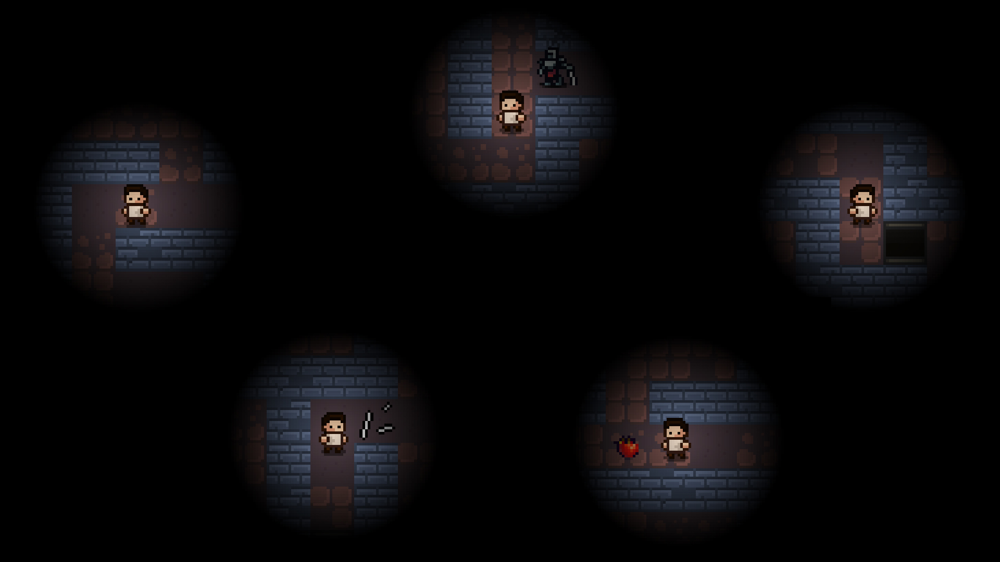

# Base information

Title: `Maze Runner`
Platform: `PC`
OS: `Windows`
Genre: `Adventure`
Multiplayer: `-`

# Gameplay

Your goal is find an exit and key to it. Pick up additional items that will be helpful for you. Use chalks to mark on the floor of the maze. Beware of traps that kill by oneshot. Avoid enemies or try out to trap them. And remember: ***everything in this maze is unpredictable***

There is **3** difficulty levels: **easy**, **normal** and **hard**, that differ in game parameters

# Features

+ Dynamic volume sound effects
+ Procedurally generated maze
 

